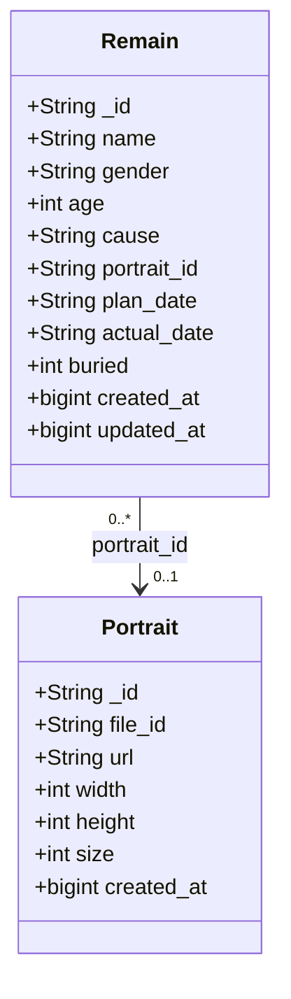
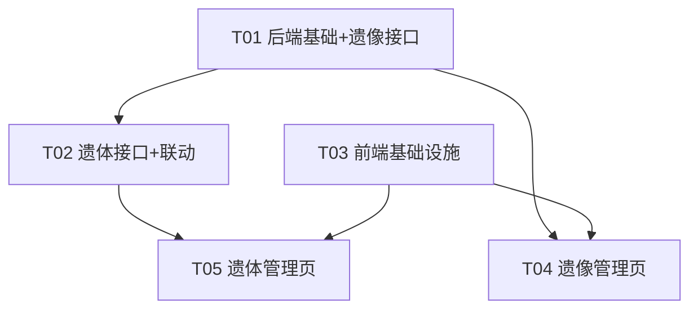
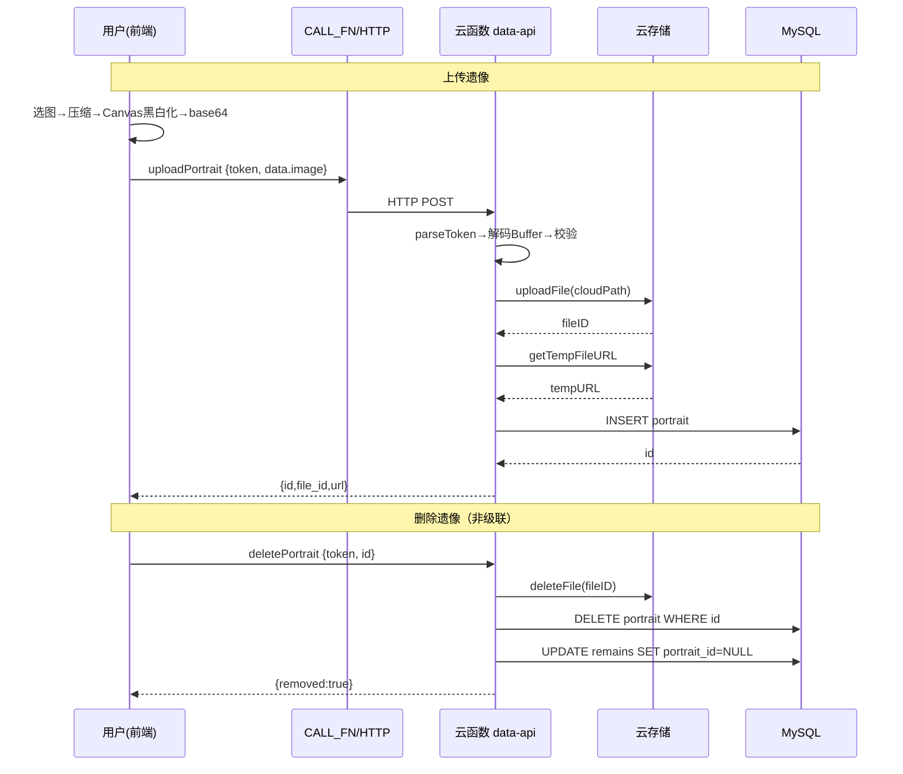

# 殡葬管理系统 · 系统设计 + 任务分解

> 架构师：高见远
> 前置输入：PRD（已确认需求）+ 现有代码 `web/index.html`、`cloudfunctions/data-api/index.js`

---

## Part A：系统设计

### 1. 实现方案与技术选型

#### 1.1 现状梳理（已读代码确认）

| 关注点 | 现状 |
|--------|------|
| 前端 | Vue 3 单文件（`./libs/vue.global.prod.js` 本地引入），黑白灰主题 + 8–12px 圆角，无构建工具 |
| 后端 | 云函数 `data-api`，`mysql2` 连 MySQL，`exports.main` 兼容 HTTP（`event.body` 字符串）+ SDK 双模式 |
| 鉴权 | 登录 `users` 表 + SHA-256 比对；token 为 base64 `{account, exp}`（7 天） |
| 建表 | `ensureTable()` 自动建表 + `information_schema` 查列 + `ALTER` 迁移 + `seedAdmin` |
| 内置用户保护 | `isSystemUser(p, id)` 查询 `is_system=1`，禁止改/删/注销 |
| fetch 封装 | 前端 `CALL_FN(data)`：POST JSON → 返回 `r.data`，`code!==0` 抛异常 |
| 云存储 | 环境已有，`EnvInfo.Storages[0].Bucket = 7465-test-d2g8lzeup3f63654a-1253559338` |

#### 1.2 核心挑战与选型决策

**① 图片上传到云存储 —— 结论：云函数代理上传（不依赖 `@cloudbase/js-sdk`）**

- 背景：`@cloudbase/js-sdk` 在浏览器存在 CDN/适配器问题（已弃用）。
- 方案：前端 Canvas 完成「压缩 + 黑白化」后，读取为 **base64（dataURL）** → 通过现有 `CALL_FN` 传给云函数 → 云函数内用 **`@cloudbase/node-sdk`** 的 `app.uploadFile()` 把 Buffer 上传到云存储（云函数运行环境自动注入环境凭证，无需手动配 SecretId/Key）→ 返回 `fileID` + 临时下载 URL → 落库。

  选型理由：
  - 云函数运行在 TCB 环境内，`@cloudbase/node-sdk` 可**免密**初始化（直接读运行时注入的 `TENCENTCLOUD_*` 环境变量），零配置、无密钥泄漏风险。
  - 复用现有 `CALL_FN` / HTTP 网关通道，无需前端额外 SDK。
  - 上传/删除由云函数统一收口，便于「删除时同步删云存储文件」。

- 备选（降级）：若 node-sdk 体积/冷启动是问题，可用 `cos-nodejs-sdk-v5` + `app.getUploadMetadata()` 拿临时密钥再 putObject。本设计以 node-sdk 为主方案。

**② 图片黑白化 —— 前端 Canvas 完成后再上传**

实现思路（纯 Canvas，无第三方库）：
1. `<input type="file" accept="image/*">` 拿到 File → `URL.createObjectURL` / `FileReader` 读入 ``。
2. 预压缩：`createImageBitmap(file, { resizeWidth/Height })` 或绘制到 2048px 以内的离屏 Canvas，保证「最长边 ≤ 2048px、文件 ≤ 5MB」。
3. 黑白化：`ctx.drawImage(img, ...)` → `ctx.getImageData` → 逐像素 `gray = 0.299R + 0.587G + 0.114B`（或 `(max+min)/2` 明度法，复古感更强）→ 写回 `R=G=B=gray` → `putImageData`。
4. 输出：`canvas.toDataURL("image/jpeg", 0.82)` → 得到 base64 字符串（体积更小），交给云函数。

**③ 数据结构**：新增 `portrait`、`remains` 两张表，沿用 `ensureTable()` + `information_schema` 迁移模式（含 `portrait_id` 外键冗余列，不做物理外键约束，避免迁移/删除复杂度）。

**④ 遗像删除的「非级联」语义**：删除 portrait 时，事务内先删云存储文件 → 删 DB 记录 → 将引用该 portrait 的 `remains.portrait_id` 置 `NULL`（前端 `portrait_id` 为空即渲染默认灰色卡通形象）。

#### 1.3 架构模式

沿用现有「单文件 Vue 组件 + 单云函数多 action」模式，不引入新分层框架：

- 前端：`Root` 根组件管理 token/导航，`LoginPage` / `PortraitManage` / `RemainManage` 三个页面组件，`CALL_FN` 统一封装。
- 后端：`handle(params)` switch 分发新增 7 个 action，复用 `ok/fail/parseToken/ensureTable/getPool` 工具函数。

---

### 2. 文件列表

```
admin-system/
├── web/
│   └── index.html                       # 【改】主体：新增肖像/遗体两页组件、导航 3 项、Canvas 工具、登录页像素装饰
├── cloudfunctions/
│   └── data-api/
│       ├── index.js                     # 【改】新增 portrait/remains 建表+迁移、7 个 action、图片上传/删除代理
│       └── package.json                 # 【改】新增 @cloudbase/node-sdk 依赖
└── docs/
    ├── system_design.md                 # 【新】本文档
    ├── class-diagram.mermaid            # 【新】类图
    └── sequence-diagram.mermaid         # 【新】时序图
```

> 前端继续单文件 `index.html`（不拆多文件，与现状一致、降低复杂度）；图片黑白化 Canvas、像素装饰均为 `<script>` / `<style>` / 内联 SVG 内实现，不新增静态资源文件。

---

### 3. 数据结构与接口

#### 3.1 数据库表设计

**① portrait 表（遗像）**

```sql
CREATE TABLE IF NOT EXISTS `portrait` (
  `id` INT UNSIGNED NOT NULL AUTO_INCREMENT,
  `file_id` VARCHAR(255) NOT NULL COMMENT '云存储 fileID',
  `url` VARCHAR(512) NOT NULL DEFAULT '' COMMENT '临时下载 URL（可过期，展示用）',
  `width` INT NOT NULL DEFAULT 0 COMMENT '处理后图片宽度 px',
  `height` INT NOT NULL DEFAULT 0 COMMENT '处理后图片高度 px',
  `size` INT NOT NULL DEFAULT 0 COMMENT '文件字节数',
  `created_at` BIGINT NOT NULL DEFAULT 0 COMMENT '创建时间戳(ms)',
  PRIMARY KEY (`id`),
  KEY `idx_created_at` (`created_at`)
) ENGINE=InnoDB DEFAULT CHARSET=utf8mb4 COLLATE=utf8mb4_unicode_ci;
```

> 需求「自增唯一 ID」直接用 `AUTO_INCREMENT` 主键满足。ID 展示字符串化（同现有 `_id`）。

**② remains 表（遗体）**

```sql
CREATE TABLE IF NOT EXISTS `remains` (
  `id` INT UNSIGNED NOT NULL AUTO_INCREMENT,
  `name` VARCHAR(64) NOT NULL COMMENT '姓名，必填',
  `gender` VARCHAR(8) NOT NULL COMMENT '性别: 男/女',
  `age` INT NOT NULL DEFAULT 0 COMMENT '终年，>=0 允许 0',
  `cause` VARCHAR(255) NOT NULL DEFAULT '' COMMENT '死因，非必填',
  `portrait_id` INT UNSIGNED NULL DEFAULT NULL COMMENT '遗像 id，可空=默认灰色卡通',
  `plan_date` VARCHAR(16) NOT NULL DEFAULT '' COMMENT '计划下葬日期 YYYY-MM-DD',
  `actual_date` VARCHAR(16) NOT NULL DEFAULT '' COMMENT '实际下葬日期 YYYY-MM-DD',
  `buried` TINYINT NOT NULL DEFAULT 0 COMMENT '是否安葬 1=是 0=否',
  `created_at` BIGINT NOT NULL DEFAULT 0,
  `updated_at` BIGINT NOT NULL DEFAULT 0,
  PRIMARY KEY (`id`),
  KEY `idx_portrait_id` (`portrait_id`),
  KEY `idx_created_at` (`created_at`)
) ENGINE=InnoDB DEFAULT CHARSET=utf8mb4 COLLATE=utf8mb4_unicode_ci;
```

> 关系：`remains.portrait_id` → `portrait.id`（逻辑外键，**不建物理外键约束**，DELETE 时由业务代码置 NULL）。`users` 表与二者无直接外键关系（仅共享同一鉴权上下文）。

#### 3.2 类图

见独立文件 `docs/class-diagram.mermaid`（要点如下）：



---

### 4. 接口设计（新增 action）

> 统一响应：`{ code:0, message:"ok", data }`；错误 `{ code:非0, message, data:null }`。
> 除 `login` 外全部需 `token`。入参 `data` 对象用于携带结构化字段。

| action | 入参 | 出参 `data` | 说明 |
|--------|------|-------------|------|
| `listPortraits` | `token` | `Portrait[]`（按 id 倒序） | 遗像列表 |
| `uploadPortrait` | `token, data:{ image: base64 字符串 }` | `{ id, file_id, url, width, height, size }` | 云函数上传云存储 + 落库 |
| `deletePortrait` | `token, id` | `{ removed:true }` | 删云存储文件 + 删记录 + 引用置 NULL |
| `listRemains` | `token, keyword?` | `Remain[]`（含 `portrait_url`，按 id 倒序） | 遗体卡片墙数据 |
| `createRemain` | `token, data:{ name, gender, age, cause?, portrait_id?, plan_date?, actual_date?, buried }` | `{ id }` | 新增遗体 |
| `updateRemain` | `token, id, data:{ ...同 create 可部分 }` | `{ updated:true }` | 修改遗体 |
| `deleteRemain` | `token, id` | `{ removed:true }` | 删除遗体（不涉云存储） |

**字段校验规则（后端强制，前端同步）：**
- `name` 必填非空；`gender` 只能 `男/女`；`age` 非负整数（允许 0）；`plan_date`/`actual_date` 若传则须匹配 `YYYY-MM-DD`，可为空串；`buried` 归一化 0/1。
- `portrait_id` 若传且非空，需校验 portrait 存在，否则返回 400。
- `uploadPortrait.image` 必须为 dataURL（`data:image/...;base64,` 前缀）；后端校验大小 ≤ 约 6.8MB base64（对应解码后 ~5MB 上限）。

---

### 5. 云存储上传方案（重点）

```
前端：File → createImageBitmap 压缩(最长边≤2048) → Canvas 黑白化 → toDataURL(jpeg,0.82)
        ↓ base64 字符串（含 dataURL 前缀）
CALL_FN({ action:"uploadPortrait", token, data:{ image } })
        ↓ HTTP 网关
云函数 uploadPortrait：
  1. parseToken 校验登录态
  2. 解码 base64 → Buffer，校验魔数(JPEG/PNG)与大小 ≤5MB
  3.懒加载 @cloudbase/node-sdk：app = require('@cloudbase/node-sdk').init({ env })
  4. res = await app.uploadFile({ cloudPath:`portrait/${Date.now()}-${rand}.jpg`, fileContent: buffer })
  5. fileID = res.fileID；临时 URL：await app.getTempFileURL({ fileList:[fileID] })
  6. INSERT portrait 记录（file_id/url/width/height/size）
  7. 返回 { id, file_id, url, ... }
```

- **删除** `deletePortrait`：先 `app.deleteFile({ fileList:[fileID] })`（尽力而为，失败仅记日志不阻断）→ DELETE DB 记录 → `UPDATE remains SET portrait_id=NULL WHERE portrait_id=?`。
- **node-sdk 免密初始化**：云函数内 `init({ env: process.env.TCB_ENV || 'test-d2g8lzeup3f63654a' })`，凭证由运行时注入，无需硬编码密钥。
- **依赖说明**：`@cloudbase/node-sdk` 需加入云函数 `package.json`（体积较大，冷启动略有影响，可接受）。

---

## Part B：任务分解

### 6. 依赖包列表（新增）

```
后端（cloudfunctions/data-api/package.json）:
- @cloudbase/node-sdk@^2.5.0   云存储上传/删除（uploadFile/getTempFileURL/deleteFile）

前端（无构建工具，不新增，继续用本地 libs/vue.global.prod.js）:
- 无需新增（Canvas 黑白化用原生 API，像素装饰用 CSS/内联 SVG）
```

### 7. 任务列表（有序、带依赖）

| Task ID | 任务名 | 源文件 | 依赖 | 优先级 |
|---------|--------|--------|------|--------|
| **T01** | 后端基础：建表迁移 + 云存储 SDK 接入 + 遗像接口 | `cloudfunctions/data-api/index.js`、`cloudfunctions/data-api/package.json` | — | P0 |
| **T02** | 后端遗体接口 + 遗像删除置 NULL 联动 | `cloudfunctions/data-api/index.js` | T01 | P0 |
| **T03** | 前端基础设施：导航 3 项 + 登录页像素装饰 + 图片工具库 | `web/index.html` | — | P0 |
| **T04** | 遗像管理页（上传/黑白化/删除/列表） | `web/index.html` | T01, T03 | P0 |
| **T05** | 遗体管理页（卡片墙/弹框增改/遗照选择）+ 联调 | `web/index.html` | T02, T03 | P0 |

> 说明：T01/T02 是后端（可合看但按接口拆分保证每任务 ≥3 处改动；实际都在 `index.js`，拆两任务利于递进验证）；T03 前端基础独立；T04/T05 依赖后端接口与前端基础。任务间线性依赖链短（T04←T01/T03，T05←T02/T03），符合「尽量独立」原则。

**各任务详细范围：**

- **T01**：`ensureTable()` 增加 `CREATE portrait/remains 表` + `migrateNewTables`（information_schema 查表缺则建、查列缺则 ALTER）；新增 `initCloud()` 懒加载 node-sdk；新增 `listPortraits/uploadPortrait/deletePortrait` 三个 action；`package.json` 加 `@cloudbase/node-sdk`。
- **T02**：新增 `listRemains/createRemain/updateRemain/deleteRemain` 四个 action；`deletePortrait` 内补齐「引用置 NULL」联动；`validate` 辅助函数。
- **T03**：`Root` 组件改造（导航 3 项 + 页面切换，保留 hover 抽屉）；`LoginPage` 底部加像素草/花/墓碑（CSS/内联 SVG）；新建 `ImageUtil`（`compress+ grayscale` Canvas 工具）、`DEFAULT_AVATAR`（灰色半身卡通 SVG）。
- **T04**：`PortraitManage` 组件 —— 上传（校验 ≤5MB/最长边 ≤2048 → 黑白化 → base64 上传）、列表展示、`一键删除`（单张删除，confirm）、空态。
- **T05**：`RemainManage` 组件 —— 每行 10 个卡通卡片墙、新增/修改弹框（遗照选择器从 portrait 拉取、默认灰卡通）、删除、`portrait_id` 空时渲染灰卡通。

### 8. 共享知识（跨文件约定）

```
- 字段命名：DB 用 snake_case（portrait_id, file_id, plan_date, actual_date, created_at）；
  前端接口出参用 cameraCase 保留（_id 字符串化；portrait_id 字符串化返回）。
- 时间：created_at/updated_at 统一 BIGINT 毫秒时间戳；日期字段 plan_date/actual_date 用 'YYYY-MM-DD' 字符串。
- 颜色/主题：沿用 :root 黑白灰变量，新增像素风只加装饰变量，不改现有 --primary/--accent 语义；
  圆角统一 8-12px（面板 10px、卡片/弹窗 12px、按钮/输入 8px）。
- fetch：全部走 CALL_FN(data)，data 必含 action + token；返回 code!==0 即抛错。
- token：base64 {account, exp}，前端 atob 还原展示账号；后端 parseToken 校验。
- 云存储：DB 只存 file_id(url 可过期，列表时可用临时 URL 或前端用内置文件句柄)；
  URL 为空/过期时前端回退用默认灰卡通占位。
- 遗像删除「非级联」：删除 portrait 必须同步把引用它的 remains.portrait_id 置 NULL。
- 内置用户：users.is_system=1 不可改/删/注销（不动现有逻辑）。
- 图片：单张 ≤5MB、最长边 ≤2048px；前端 toDataURL('image/jpeg',0.82) 后以 base64 传云函数。
```

### 9. 任务依赖图



### 10. 待明确事项

1. **云存储临时 URL 过期**：`getTempFileURL` 默认 2 小时有效。卡片墙若长时间停留，图片可能失效。建议：列表接口实时换取临时 URL（不落库长期 URL），或在 `listPortraits/listRemains` 返回时批量 `getTempFileURL`。当前设计采用「列表时后端批量换取临时 URL 随数据返回」，`file_id` 长期落库。
2. **`@cloudbase/node-sdk` 免密初始化可用性**：需云函数部署环境确实注入 TCB 凭证（通常云函数内 `init({env})` 免密可用；若该环境被禁用会失败）。若不可用，降级方案为手动配置 `secretId/secretKey`（不推荐留仓库）。
3. **遗像「一键删除」范围确认**：需求已确认是「单张遗像删除」而非「全部一键清空」，本设计按单张实现；如需「全部清空」批量删除，可后续扩展 `deleteAllPortraits`。
4. **`cloudbase.full.js`（web/lib 下遗留）**：既然 js-sdk 已弃用直传，该文件可保留不引用，暂不删除以免误伤；如确认无用可后续清理。

---

## 附：关键时序图（另存 `docs/sequence-diagram.mermaid`）


